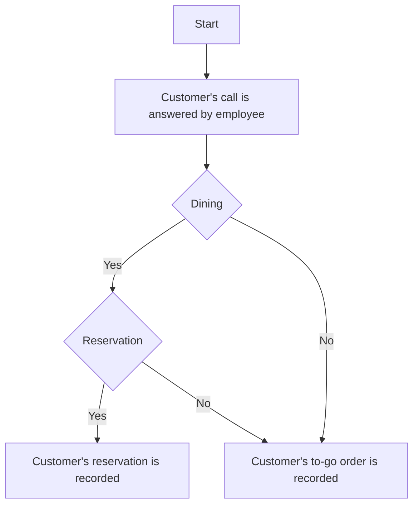
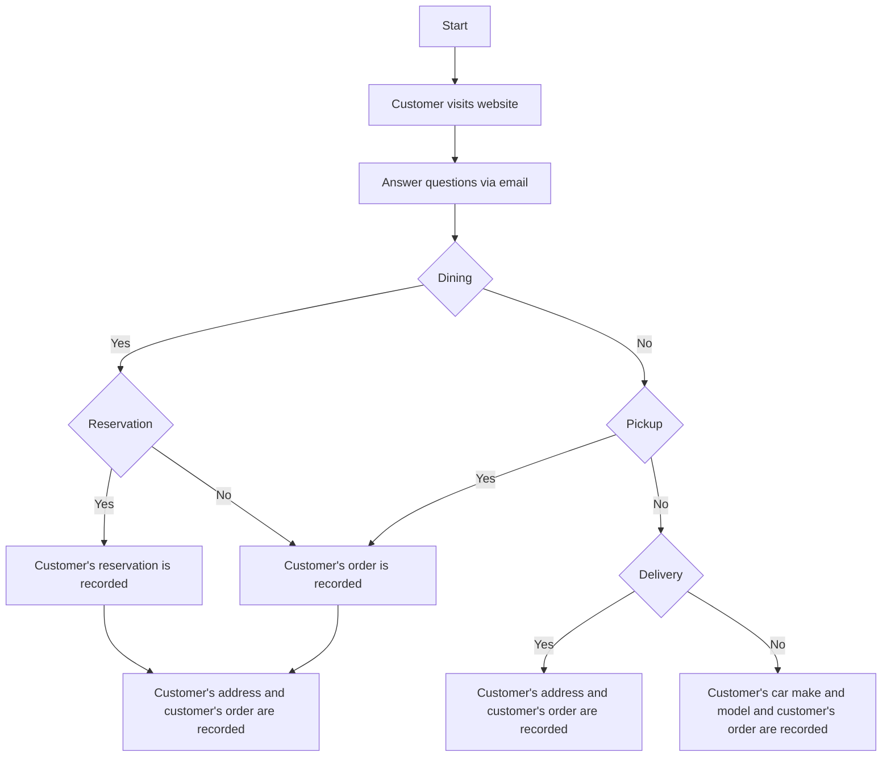
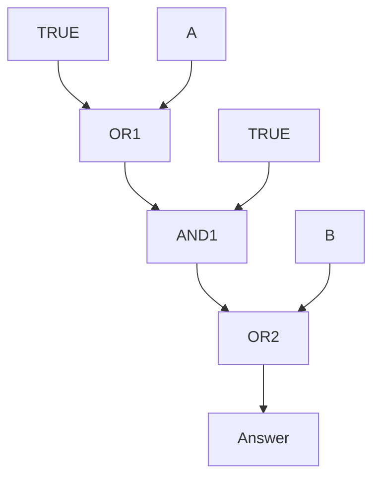
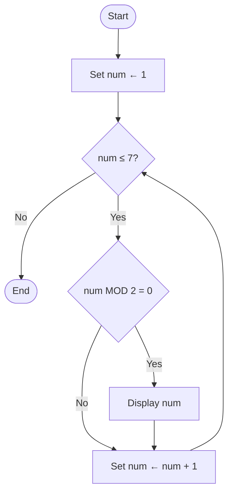

0. 3 3
0. 3 8
1. 11 3
0. 3 11

Consider the following code segment, which uses the variable a and c  
```
a <- 3  
a <- a + 5  
c <- 3  
a <- c + a  

Display(a)  
Display(c)
```
what is displayed when running the code segment?

---

0. Logic error on line 1  
0. Syntax error on line 4  
1. Runtime error on line 4  
0. Overflow error on line 1  

What type of error will the following procedure cause?  
```
Line 1: alist ← [1, 1, 35, 6]  
Line 2: DISPLAY mystery(alist)  
Line 3: PROCEDURE mystery(alist)  
Line 4: RETURN alist[0]  
```

---

0. Friend  
0. FriendFriend  
1. FriendCatMeowCowBarkFriend  
0. a  

What will the following code display?  

```
words ← ["Cat", "Meow", "Cow", "Bark"]  
DISPLAY mystery(words)  

PROCEDURE mystery(words)  
 a ← "Friend"  
 FOR EACH item IN words  
  a ← a + item  
 a ← a + "Friend"  
 RETURN a
```
---

0. Name  
0. Order  
0. Time of pickup or reservation  
1. Customer's car make and model  

A restaurant uses phones to take reservations and to place to-go orders. The restaurant is planning to update its system to provide more options to customers while decreasing the ordering time. Customers will now interact with a website instead of an actual person.

The **upgraded system** (but not the original system) stores all information from the web interactions for future references. This includes food items ordered, address, telephone number, and credit card info.

The original system and the upgraded system are described in the following flowcharts. Each flowchart uses the following blocks:

| Block         | Explanation                                                                 |
|---------------|------------------------------------------------------------------------------|
| Oval          | The start of the algorithm                                                   |
| Parallelogram | An input or output step                                                      |
| Diamond       | A conditional or decision step, where execution proceeds to "Yes" or "No"   |
| Rectangle     | The result of the algorithm                                                  |

Original System


Upgraded System


Which of the following input data is needed by the upgraded system but was NOT needed by the original system?

---

1. IP address of the customer  
0. Previous list of food orders  
0. A list of popular items frequently added to orders  
0. Time to prepare order  

The upgraded system uses data not supplied by the customer. The new site is supposed to increase sales by suggesting products (like “fries with that?”) and decreasing processing time.

Which of the following data is LEAST likely to be included in the web-based ordering system?

---

0. Storing credit card information can provide the user with a better experience by auto filling in data to speed up ordering  
0. Previous list of food orders  
0. Storing customer information will increase the likelihood of a phishing attack by rogue hackers  
1. Customers’ personal data can be compromised if hackers gain access into the ordering system  

Which of the following is MOST likely a data privacy concern of the upgraded system?

---

0. Customers being more likely to order to-go orders  
0. An increase in food per order  
1. An increase in awareness of the restaurant  
0. A decrease in incorrect orders and delivery addresses  

Of the following potential benefits, which is LEAST likely to be provided by the upgraded system?

---

0. Reservations for the restaurant will increase  
0. Increase income for the staff  
1. Reservations will be primarily made by customers who can afford internet access  
0. Repeat business will increase  

Which of the following may be an unintended effect of the upgraded system?

---

0. A AND B  
0. A OR B  
0. NOT(A OR B)  
1. A AND NOT(B)  

What can replace `[missing condition]` to complete the last column of the table?

| A | B | [missing condition] |
|---|---|----------------------|
| F | F | T                    |
| F | T | F                    |
| T | F | F                    |
| T | T | F                    |

---

0. TRUE when both A and B are TRUE only  
0. TRUE when A is TRUE and B is FALSE  
1. Always TRUE regardless of the values of A and B  
0. Always FALSE regardless of the values of A and B  

The diagram below shows a circuit composed of logic gates. Each gate takes two inputs and produces a single output. What will the algorithm produce?

Diagram:


---
18
1. The program correctly displays the count if the target is not in the list.  
0. The program never correctly displays the correct value for count.  
1. The program correctly displays the count if the target appears once in the list and also at the end of the list.  
0. The program always correctly displays the correct value for count.  

Consider the following procedure called `mystery`, which is intended to display the number of times a number `target` appears in a list.

```
PROCEDURE mystery(list, target)
 count ← 0
 FOR EACH item IN list
  IF item = target
   count ← count + 1
 DISPLAY count
```
Which of the following best describes the behavior of the procedure?  
**Select two answers.**

---

0. list1 ← Sort(list1)  
   list2 ← Sort(list2)  
   resultList ← Combine(list1, list2)  
   BinarySearch(resultList, value)  

0. resultList ← Combine(list1, list2)  
   BinarySearch(resultList, value)  

1. resultList ← Sort(Combine(list1, list2))  
   BinarySearch(resultList, value)  

0. BinarySearch(list1, value)  
   BinarySearch(list2, value)  

Which of the following code segments will correctly search for a value using a binary search?

**Abstractions used:**  
- `Sort(list)` — Sorts a list from lowest to highest number  
- `Combine(list1, list2)` — Creates a new list by combining the elements of list1 followed by the elements of list2  
- `BinarySearch(list, value)` — Returns the index of `value` in `list` using a binary search. Returns -1 if not in the list.

---

1. IF RANDOM(1, 100) = 4  
   MOVE_FORWARD()  

0. IF RANDOM(0, 100) = 4  
   MOVE_FORWARD()  

1. IF RANDOM(1, 100) < 2  
   MOVE_FORWARD()  

0. IF RANDOM(1, 100) ≤ 2  
   MOVE_FORWARD()  

Which of the following codes would move the robot one square forward 1% of the time?  

The question uses a robot in a grid of squares. The robot is represented as a triangle, which is initially facing toward the top of the grid.

---

0. 2  
1. 3  
0. 23  
0. 24  

Using a binary search, how many iterations would it take to find the letter `u`?

str ← [a, b, c, d, e, f, g, h, i, j, k, l, m, n, o, p, q, r, s, t, u, v, w, x, y, z]

---

0. 3  
0. 4  
0. 23  
1. 24  

Using a linear search, how many iterations would it take to find the letter `x`?

str ← [a, b, c, d, e, f, g, h, i, j, k, l, m, n, o, p, q, r, s, t, u, v, w, x, y, z]

---

0. 6  
1. 8  
0. 10  
0. No numbers due to an infinite loop  

What will the below algorithm display?

**Flowchart Blocks Used:**  
- **Oval**: The start or end of the algorithm  
- **Parallelogram**: Display a message  
- **Diamond**: A conditional or decision step  
- **Rectangle**: One or more processing steps, such as a statement that assigns a value to variables



---

0. The application of each step of an algorithm in the order in which the statements are given  
1. Using a Boolean condition to determine which part of an algorithm is used  
0. The repetition of part of an algorithm until a condition is met or for a specified number of times  
0. The decision to use a high-level computing language to evaluate an algorithm  

Sequencing, selection, and iteration are building blocks of algorithms.  
Which of the following is considered **selection**?

---

1. Linear search  
0. Binary search  
0. Bubble sort  
0. Insertion sort  

If your algorithm needs to search through a list of sorted words, what type of search would you use?

---

0. Flu  
0. Cold  
0. Flu Healthy  
1. Flu Cold Healthy  

The code segment below is a test program intended to diagnose the disease held by a young child based on a user’s entry of `fatigue_present` and `has_cough`.
```
IF fatigue_present AND has_cough
 DISPLAY "Flu"

IF has_cough
 DISPLAY "Cold"

DISPLAY "Healthy"
```
If all variables have the value TRUE, what is displayed as a result of running the segments as shown?

---

0. -1  
0. -5  
1. 5  
0. 20  

What is a possible value that can be displayed after this code segment is run?
```
a ← RANDOM(1, 10)
b ← RANDOM(11, 20)
a ← a - b
DISPLAY(a * -1)
```

---

0. 1 4 7 10 13  
0. 35  
1. 13 10 7 4 1  
0. 1 4 7 1 4 7  

What will the following code segment display?
```
nums ← [1, 4, 7, 10, 13]
count ← 0

REPEAT LENGTH(nums) TIMES
 DISPLAY nums[LENGTH(nums) - count]
 count ← count + 1
```

---

1. -98  
0. -4  
0. 0  
0. 76  

What is displayed after running the following algorithm?
```
list1 ← [1, 35, 6, 76, -4, -98]
min ← 0
FOR EACH item IN list1
 IF item < min
  min ← item
DISPLAY min
```

---

0. -98  
0. -76  
0. -1  
1. 0  

What is displayed after running the following algorithm?
```
list1 ← [-1, -35, -6, -76, -4, -98]
max ← 0
FOR EACH item IN list1
 IF item > max
  max ← item
DISPLAY max
```

---

0. PROCEDURE getTotalEven(list)  
    total ← 0  
    FOR EACH item IN list  
        total ← total + item  
    DISPLAY total  
0. PROCEDURE getTotalEven(list)  
    total ← 0  
    FOR EACH item IN list  
     total ← total + (item MOD 2)  
    DISPLAY total  
1. PROCEDURE getTotalEven(list)  
    total ← 0  
     FOR EACH item IN list  
        IF item MOD 2 = 1  
         total ← total + item  
    DISPLAY total  
0. PROCEDURE getTotalEven(list)  
     total ← 0  
     FOR EACH item IN list  
     IF item MOD 2 = 1  
      total ← total + item  
     DISPLAY total  

The procedure `getTotalEven` is intended to display the sum of all the even numbers in the list.  
Which of the following procedures will **correctly** display the total of the even numbers in the list?

---

0. 0%  
0. 25%  
1. 50%  
0. 100%  

What is the percentage chance that the robot lands on the star?
<table style="border-collapse: collapse; text-align: center;">
  <tbody>
    <tr>
      <td style="width: 50px; height: 50px; border: 1px solid #ccc;"></td>
      <td style="width: 50px; height: 50px; border: 1px solid #ccc;"></td>
      <td style="width: 50px; height: 50px; border: 1px solid #ccc;"></td>
      <td style="width: 50px; height: 50px; border: 1px solid #ccc;"></td>
      <td style="width: 50px; height: 50px; border: 1px solid #ccc;"></td>
    </tr>
    <tr>
      <td style="width: 50px; height: 50px; border: 1px solid #ccc;"></td>
      <td style="width: 50px; height: 50px; border: 1px solid #ccc;"></td>
      <td style="width: 50px; height: 50px; border: 1px solid #ccc;"></td>
      <td style="width: 50px; height: 50px; border: 1px solid #ccc;"></td>
      <td style="width: 50px; height: 50px; border: 1px solid #ccc;"></td>
    </tr>
    <tr>
      <td style="width: 50px; height: 50px; border: 1px solid #ccc;"></td>
      <td style="width: 50px; height: 50px; border: 1px solid #ccc;"></td>
      <td style="width: 50px; height: 50px; border: 1px solid #ccc; font-size: 24px;">▶️</td> <!-- 로봇 -->
      <td style="width: 50px; height: 50px; border: 1px solid #ccc;"></td>
      <td style="width: 50px; height: 50px; border: 1px solid #ccc; font-size: 24px;">★</td> <!-- 별 -->
    </tr>
    <tr>
      <td style="width: 50px; height: 50px; border: 1px solid #ccc;"></td>
      <td style="width: 50px; height: 50px; border: 1px solid #ccc;"></td>
      <td style="width: 50px; height: 50px; border: 1px solid #ccc;"></td>
      <td style="width: 50px; height: 50px; border: 1px solid #ccc;"></td>
      <td style="width: 50px; height: 50px; border: 1px solid #ccc;"></td>
    </tr>
    <tr>
      <td style="width: 50px; height: 50px; border: 1px solid #ccc;"></td>
      <td style="width: 50px; height: 50px; border: 1px solid #ccc;"></td>
      <td style="width: 50px; height: 50px; border: 1px solid #ccc;"></td>
      <td style="width: 50px; height: 50px; border: 1px solid #ccc;"></td>
      <td style="width: 50px; height: 50px; border: 1px solid #ccc;"></td>
    </tr>
  </tbody>
</table>

```
REPEAT UNTIL (CAN_MOVE(forward) = false)
 MOVE_FORWARD()
REPEAT 6 TIMES
 ROTATE_RIGHT
x ← RANDOM(0, 3)
IF x ≤ 0.3
REPEAT x TIMES
 MOVE_FORWARD
```

---

0. MoveForward(4)  
TurnRight(1)   
MoveForward(4)  
TurnRight(1)  
MoveForward(1)  
TurnRight(1)  
MoveForward(1)  
0. MoveForward(4)  
TurnRight(3)  
MoveForward(4)  
TurnRight(1)  
MoveForward(1)  
TurnRight(3)  
MoveForward(1)  
1. MoveForward(3)  
TurnRight(3)  
MoveForward(3)  
TurnRight(1)  
MoveForward(1)  
TurnRight(3)  
MoveForward(1)  
0. MoveForward(3)  
TurnRight(3)  
MoveForward(3)  
TurnRight(3)  
MoveForward(1)  
TurnRight(3)  
MoveForward(1)  

The following question uses a robot in a grid of squares.  
The robot is represented as a triangle, which is initially in the **bottom-left square and facing right**.  
Which of the following code segments places the robot in the gray goal?  
```java
PROCEDURE moveForward (int y)
{
    REPEAT y TIMES
    {
        MOVE_FORWARD()
    }
}

PROCEDURE TurnRight (int x)
{
    REPEAT x TIMES
    {
        TURN_RIGHT()
    }
}
```
<table style="border-collapse: collapse;">
  <tbody>
    <!-- Row 1 -->
    <tr>
      <td style="width:52px; height:52px; background:black; border:1px solid black;"></td> <!-- (1,1) -->
      <td style="width:52px; height:52px; background:black; border:1px solid black;"></td> <!-- (1,2) -->
      <td style="width:52px; height:52px; background:black; border:1px solid black;"></td> <!-- (1,3) -->
      <td style="width:52px; height:52px; background:black; border:1px solid black;"></td> <!-- (1,4) -->
      <td style="width:52px; height:52px; background:gray; border:1px solid black;"></td>  <!-- (1,5) 목표 -->
    </tr>
    <!-- Row 2 -->
    <tr>
      <td style="width:52px; height:52px; background:black; border:1px solid black;"></td> <!-- (2,1) -->
      <td style="width:52px; height:52px; background:black; border:1px solid black;"></td> <!-- (2,2) -->
      <td style="width:52px; height:52px; background:black; border:1px solid black;"></td> <!-- (2,3) -->
      <td style="width:52px; height:52px; background:white; border:1px solid black;"></td> <!-- (2,4) -->
      <td style="width:52px; height:52px; background:white; border:1px solid black;"></td> <!-- (2,5) -->
    </tr>
    <!-- Row 3 -->
    <tr>
      <td style="width:52px; height:52px; background:black; border:1px solid black;"></td> <!-- (3,1) -->
      <td style="width:52px; height:52px; background:black; border:1px solid black;"></td> <!-- (3,2) -->
      <td style="width:52px; height:52px; background:black; border:1px solid black;"></td> <!-- (3,3) -->
      <td style="width:52px; height:52px; background:white; border:1px solid black;"></td> <!-- (3,4) -->
      <td style="width:52px; height:52px; background:black; border:1px solid black;"></td> <!-- (3,5) -->
    </tr>
    <!-- Row 4 -->
    <tr>
      <td style="width:52px; height:52px; background:black; border:1px solid black;"></td> <!-- (4,1) -->
      <td style="width:52px; height:52px; background:black; border:1px solid black;"></td> <!-- (4,2) -->
      <td style="width:52px; height:52px; background:black; border:1px solid black;"></td> <!-- (4,3) -->
      <td style="width:52px; height:52px; background:white; border:1px solid black;"></td> <!-- (4,4) -->
      <td style="width:52px; height:52px; background:black; border:1px solid black;"></td> <!-- (4,5) -->
    </tr>
    <!-- Row 5 -->
    <tr>
      <td style="width:52px; height:52px; background:white; border:1px solid black; font-size: 24px;">▶️</td> <!-- (5,1) 로봇 -->
      <td style="width:52px; height:52px; background:white; border:1px solid black;"></td>  <!-- (5,2) -->
      <td style="width:52px; height:52px; background:white; border:1px solid black;"></td>  <!-- (5,3) -->
      <td style="width:52px; height:52px; background:white; border:1px solid black;"></td>  <!-- (5,4) -->
      <td style="width:52px; height:52px; background:black; border:1px solid black;"></td> <!-- (5,5) -->
    </tr>
  </tbody>
</table>

---

1. []  
0. [-4, -98]  
0. [1, 35, 6, 76, -4, -98]  
0. [6, 4, 98]  

What elements does list2 contain after the algorithm is run?

```
list1 ← [1, 1, 35, 6, 76, -4, -98]
list2 ← [ ]

FOR EACH item IN list1
 IF item MOD 2 = 0 AND item MOD 2 = 1
  APPEND list2, item
```

---

0. 2xy  
0. y × (x − 1)  
0. 2x  
0. x × y  

How many times does the inner loop iterate in the following?
```
REPEAT x TIMES
{
    REPEAT y TIMES
    {
        <Program Statement>
    }
}
```

---

0. ROTATE_LEFT()
   MOVE_FORWARD()
   MOVE_FORWARD()
   MOVE_FORWARD()
   MOVE_FORWARD()
   ROTATE_LEFT()
   MOVE_FORWARD()
   MOVE_FORWARD()
   MOVE_FORWARD()
   MOVE_FORWARD()
0. ROTATE_LEFT()
   REPEAT 4 TIMES
   {
    MOVE_FORWARD()
   }
   ROTATE_LEFT()
   REPEAT 4 TIMES
   {
    MOVE_FORWARD()
   }
0. ROTATE_LEFT()
   REPEAT 4 TIMES
   {
    MOVE_FORWARD()
   }
   ROTATE_LEFT()
   ROTATE_LEFT()
   REPEAT 4 TIMES
   {
    MOVE_FORWARD()
   }
1. REPEAT 4 TIMES
   {
    MOVE_FORWARD()
   }
   ROTATE_LEFT()
   REPEAT 4 TIMES
   {
    MOVE_FORWARD()
   }

The figure below uses a robot in a grid of squares. The robot is represented as a triangle, which is initially in the bottom-left square and facing right. Which of the following algorithms will place the robot into the grey square?

<div style="display: grid; grid-template-columns: repeat(5, 52px); grid-template-rows: repeat(5, 52px); width: 260px; border: 2px solid black;">
  <!-- Row 1 -->
  <div style="background:white; border: 1px solid black;"></div>
  <div style="background:white; border: 1px solid black;"></div>
  <div style="background:white; border: 1px solid black;"></div>
  <div style="background:white; border: 1px solid black;"></div>
  <div style="background:gray; border: 1px solid black;"></div>
  <!-- Row 2 -->
  <div style="background:white; border: 1px solid black;"></div>
  <div style="background:white; border: 1px solid black;"></div>
  <div style="background:white; border: 1px solid black;"></div>
  <div style="background:white; border: 1px solid black;"></div>
  <div style="background:white; border: 1px solid black;"></div>
  <!-- Row 3 -->
  <div style="background:white; border: 1px solid black;"></div>
  <div style="background:white; border: 1px solid black;"></div>
  <div style="background:white; border: 1px solid black;"></div>
  <div style="background:white; border: 1px solid black;"></div>
  <div style="background:white; border: 1px solid black;"></div>
  <!-- Row 4 -->
  <div style="background:white; border: 1px solid black;"></div>
  <div style="background:white; border: 1px solid black;"></div>
  <div style="background:white; border: 1px solid black;"></div>
  <div style="background:white; border: 1px solid black;"></div>
  <div style="background:white; border: 1px solid black;"></div>
  <!-- Row 5 -->
  <div style="background:white; border: 1px solid black; display: flex; align-items: center; justify-content: center;">▶️</div>
  <div style="background:white; border: 1px solid black;"></div>
  <div style="background:white; border: 1px solid black;"></div>
  <div style="background:white; border: 1px solid black;"></div>
  <div style="background:white; border: 1px solid black;"></div>
</div>

---

0. 0%  
0. 10%  
0. 40%  
1. 50%

What percentage of the time will the following program display an even number?
```
DISPLAY(RANDOM(1, 10))
```

---

0.  
num ← input()  
IF num > 0 and num < 10  
  DISPLAY("waffles")  
IF num > 10 and num < 20  
  DISPLAY("Novack")  
ELSE  
  DISPLAY("Benji")

0.  
num ← input()  
IF num ≥ 0 and num ≤ 10  
  DISPLAY("waffles")  
IF num ≥ 11 and num ≤ 20  
  DISPLAY("Novack")  
ELSE  
  DISPLAY("Benji")

0.  
num ← input()  
IF num ≥ 0 and num ≤ 10  
  DISPLAY("waffles")  
ELSE IF num ≥ 11 and num ≤ 20  
  DISPLAY("Novack")  
ELSE  
  DISPLAY("Benji")

1.  
num ← input()  
IF num ≥ 0 and num ≤ 10  
  DISPLAY("waffles")  
IF num ≥ 11 and num ≤ 20  
  DISPLAY("Novack")  
IF num > 20  
  DISPLAY("Benji")

Which of the following codes performs the following?

Step 1: A user enters a number.  
Step 2: If the number is between 0 and 10 inclusive, write the word *Waffles*.  
Step 3: If the number is between 11 and 20 inclusive, write the word *Novack*.  
Step 4: If it’s any other number, write the word *Benji*.

---

1. num > 13 OR num = 13  
0. num > 13  
0. num < 13 AND num = 13  
0. num > 13 AND num = 13  

Which of the expressions are equivalent to the Boolean expression NOT(num < 13)?

---

1. Heuristic solutions are used when an exact solution is not needed. By not checking every file and instead just investigating the most likely infected programs, it will decrease the run time of antivirus programs.  
0. A heuristic solution will fully guarantee that the entire computer will be virus free.  
0. It is able to pick out viruses without selecting false positives and without requiring a full file scan at all.  
0. It is more capable of separating dangerous viruses from simple adware.  

Why would a heuristic analysis be useful in an antivirus program?

---

0. RANDOM(1, 5) < 2  
1. RANDOM(1, 10) < 6  
1. RANDOM(1, 2) = 2  
0. RANDOM(6, 10) < 6  

A simulation for a coin flip should result in 50% heads and 50% tails.  
Select two answers that could replace the missing condition.
```
sum ← 0  
REPEAT 1000 TIMES  
  IF < MISSING CONDITION >  
    sum ← sum + 1  

IF sum = 500  
  DISPLAY "TRUE"  
ELSE  
  DISPLAY "FALSE"
```
**Select two answers.**

---

1. 1  
0. 5  
0. 6  
1. 10  

Which of the following is **NOT** a possible answer?

**Select two answers.**  

`DISPLAY(RANDOM(1, 4) + RANDOM(2, 5))`

---

1. x > 8  
1. x <= 10  
0. x > 10  
0. x >= 10  

The algorithm below displays TRUE 60% of the time.

```
x ← RANDOM(5 , 14)
IF <MISSING CONDITION>
    DISPLAY("TRUE")
ELSE
    DISPLAY("FALSE")
```
What can replace "MISSING CONDITION" so that the algorithm works as intended?
**Select Two Answers*

---

