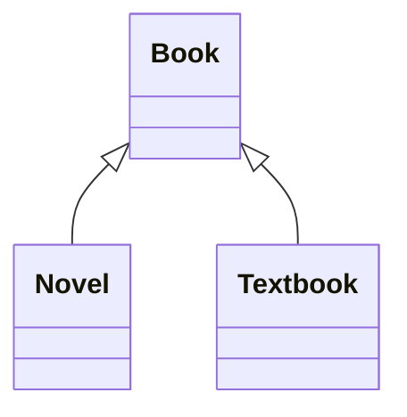

0. The Textbook class can have private instance variables that are in neither Book nor Novel.
0. Each of the classes Book, Novel, and Textbook can have a method computeShelfLife, whose code is different from the code in Textbook.
0. If the Book class has private instance variables title and author, then Novel and Textbook cannot directly access them.
1. Both Novel and Textbook inherit the constructors in Book.
0. If the Book class has a private method called readFile, this method may not be accessed in either the Novel or Textbook classes.

Which of the following is a false statement about the classes shown?



---

1. Composition  
0. Inheritance  
0. Independent classes  
0. Polymorphism  
0. ArrayList  

A programmer is designing a program to catalog all books in a library. She plans to have a `Book` class that stores features of each book: `author`, `title`, `isOnShelf`, and so on, with operations like `getAuthor`, `getTitle`, `getShelfInfo`, and `setShelfInfo`. Another class, `LibraryList`, will store an array of `Book` objects. The `LibraryList` class will include operations such as `listAllBooks`, `addBook`, `removeBook`, and `searchForBook`. What is the relationship between the `LibraryList` and `Book` classes?

---

0. I only  
1. II only  
0. III only  
0. I and III only  
0. II and III only  

Consider the implementation of a `writeDeck` method that is added to the `Deck` class:

```java
public class Card
{
    private String suit;
    private int value;  // 0 to 12

    public Card(String cardSuit, int cardValue)
    { /* implementation */ }

    public String getSuit()
    {
        return suit;
    }

    public int getValue()
    {
        return value;
    }

    public String toString()
    {
        String faceValue = "";
        if (value == 11)
            faceValue = "J";
        else if (value == 12)
            faceValue = "Q";
        else if (value == 0)
            faceValue = "K";
        else if (value == 1)
            faceValue = "A";

        if (value >= 2 && value <= 10)
            return value + " of " + suit;
        else
            return faceValue + " of " + suit;
    }
}

public class Deck
{
    private Card[] deck;
    public final static int NUMCARDS = 52;

    public Deck()
    {
        ...
    }

    /** Simulate shuffling the deck. */
    public void shuffle()
    {
        ...
    }
    // Other methods are not shown.
}
```
```java
/** Write the cards in deck, one per line. */
public void writeDeck()
{
    /* implementation code */
}
```
Which of the following is correct implementation code?
```java
I.   System.out.println(deck);

II.  for (Card card : deck)
         System.out.println(card);

III. for (Card card : deck)
         System.out.println((String) card);
```

---
