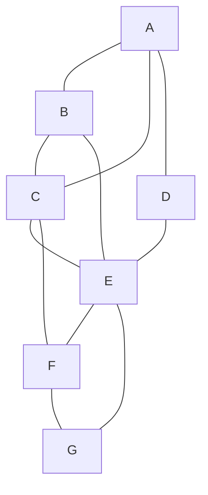

0. 2 × 96  
1. 2^96  
0. 96^2  
0. 96 

With the lowering of the digital divide and more products using the internet, the world is running out of IP addresses. The current plan is to switch from IPv4, which holds 32 bits, to IPv6, which holds 128 bits.

With the increase from 32 bits to 128 bits, what is the resulting increase in possible IP addresses?

---

0. I and II only  
0. II and III only  
0. I and III only  
1. I, II, and III  

Which of the following trade-offs is true when representing information as digital data?  
I. An analog signal must be sampled and turned into numbers that are then stored digitally as bits.  
II. Reading data and updating data have different storage requirements.  
III. Lossy data compression reduces the number of bits stored or transmitted at the cost of being able to reconstruct only an approximation of the original.

---

1. 1  
0. 2  
0. 3  
0. 4  

This is a web of devices connected through the fault-tolerant redundant internet.
What is the minimum number of other devices that device C must connect with to communicate with D?

---

0. I only  
0. III only  
0. I and III only  
1. I, II, and III  

A smartphone stores the following data for each picture taken using the phone:  
The location where the photo was taken  
The number of photos taken at the location  
The date and time the photo was taken  
The filename of the photo  

Which of the following can be determined using the metadata described above?

I. How many photos were taken at Walt Disney World  
II. The name of the person who took the most recent photo  
III. Whether people tend to take more photos on the weekend than during the week  

---

0. 1 line  
1. 3 lines  
0. 4 lines  
0. 5 lines  

How many lines need to be cut to completely isolate A?

  <!-- Center node -->
  

  <!-- A (top) -->
  
A

  <svg style="position: absolute; top: 40px; left: 150px;" width="2" height="90">
    <line x1="1" y1="90" x2="1" y2="0" stroke="white" stroke-width="2" />
  </svg>

  <!-- B (left) -->
  
B

  <svg style="position: absolute; top: 150px; left: 40px;" width="90" height="2">
    <line x1="90" y1="1" x2="0" y2="1" stroke="white" stroke-width="2" />
  </svg>

  <!-- C (right) -->
  
C

  <svg style="position: absolute; top: 150px; left: 170px;" width="90" height="2">
    <line x1="0" y1="1" x2="90" y2="1" stroke="white" stroke-width="2" />
  </svg>

  <!-- D (bottom-left) -->
  
D

  <svg style="position: absolute; top: 170px; left: 70px;" width="80" height="80">
    <line x1="80" y1="0" x2="0" y2="80" stroke="white" stroke-width="2" />
  </svg>

  <!-- E (bottom-right) -->
  
E

  <svg style="position: absolute; top: 170px; left: 150px;" width="80" height="80">
    <line x1="0" y1="0" x2="80" y2="80" stroke="white" stroke-width="2" />
  </svg>

---

0. 2 seconds  
0. 6 seconds  
0. 8 seconds  
1. 16 seconds  

Which of the following best approximates the minimum possible time to run all three processes in series?

| Process | Execution Time (seconds) |
|---------|--------------------------|
| One     | 8                        |
| Two     | 2                        |
| Three   | 6                        |

A certain computer has a single central processing unit (CPU). The following table indicates the amount of time the computer takes to execute processes using a single CPU. Assume none of the processes are dependent on any other process.

---

1. 1  
0. 7  
0. 11,356  
0. 12,587  

In a centralized internet, what is the minimum number of nodes needed to disable the internet?

---

0. I only  
0. II only  
0. I and II only  
1. I and III only  

Which of the following describes a lossy transformation of digital data?

I. Compressing an image file into a smaller resolution image so the image can easily be emailed  
II. Inverting the colors of an image by subtracting each RGB value from 255  
III. Converting an image by averaging its RGB values and assigning the new value to a shade of gray ranging from white to black

---

0. IV → II → I → III  
0. I → III → IV → II  
0. I → IV → II → III  
1. I → IV → III → II  

The following are steps data take as the data travel across the internet.  
I. Data are chopped into chunks called packets.  
II. Packets are reassembled into a coherent message.  
III. Packets are routed throughout the internet.  
IV. Packets go through internet service providers (ISPs) to access the internet.  

Which of the following is the correct path data take when the data travel from one device to another device through the internet?

---

